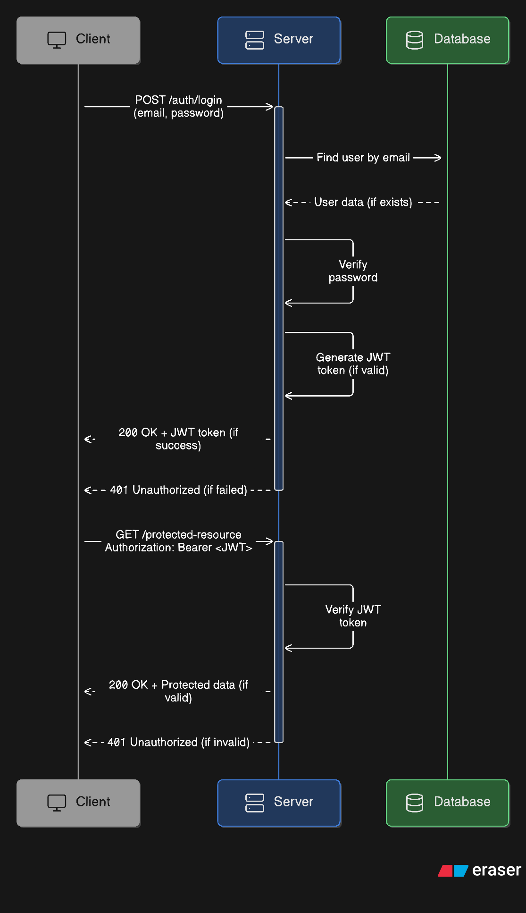
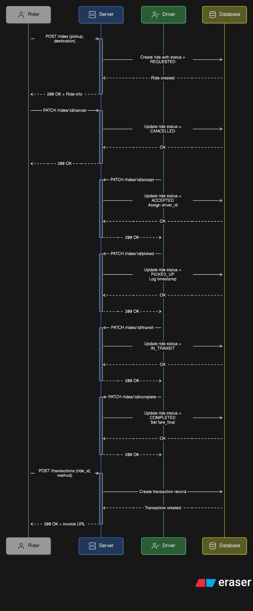

# Ride Booking System - Backend API

A robust, scalable REST API for a ride-booking platform built with **Express.js**, **TypeScript**, **MongoDB**, and **pnpm**. This backend serves as the core engine for managing riders, drivers, ride requests, and administrative operations.

## 🌟 Features

- **🔐 JWT Authentication**: Secure token-based authentication with refresh tokens
- **👥 Role-based Access Control**: Support for riders, drivers, and administrators
- **🚗 Complete Ride Management**: Full ride lifecycle from request to completion
- **💰 Transaction Processing**: Integrated payment and earnings system
- **📊 Admin Dashboard APIs**: Comprehensive administrative controls
- **🔍 Advanced Querying**: Pagination, sorting, and filtering capabilities
- **📧 Email Services**: Multi-provider email system (Gmail, Resend)
- **🛡️ Security**: Helmet.js, CORS, input validation with Zod
- **📝 Comprehensive Logging**: Structured logging with Pino
- **🏗️ Modular Architecture**: Clean, maintainable codebase structure

## 🏗️ Architecture

### Core Components

- **Authentication System**: JWT-based auth with role management
- **User Management**: Profile management for all user types
- **Driver Management**: Driver applications, approvals, and status tracking
- **Ride System**: Request, matching, tracking, and completion workflow
- **Transaction System**: Payment processing and earnings management
- **Admin Panel**: User management, driver approvals, system oversight

### Database Models

- **User**: Base user model with role-based access
- **Driver**: Driver-specific information and status
- **Ride**: Complete ride information and status tracking
- **Transaction**: Payment and earnings records

## 🚀 Quick Start

### Prerequisites

- **Node.js** >= 18.0.0
- **pnpm** >= 8.0.0
- **MongoDB** >= 5.0
- **Redis** (optional, for caching)

### Installation

1. **Navigate to backend directory:**

   ```bash
   cd apps/backend
   ```

2. **Install dependencies:**

   ```bash
   pnpm install
   ```

3. **Environment Setup:**

   ```bash
   cp .env.example .env
   ```

4. **Configure Environment Variables:**

   ```env
   # Server Configuration
   NODE_ENV=development
   PORT=3000
   HOST=localhost

   # Database
   DB_URI=mongodb://localhost:27017/ride-booking

   # JWT Secrets
   JWT_ACCESS_SECRET=your-super-secret-access-key
   JWT_REFRESH_SECRET=your-super-secret-refresh-key
   JWT_ACCESS_EXPIRES_IN=24h
   JWT_REFRESH_EXPIRES_IN=7d

   # Email Configuration (Optional)
   GMAIL_USER=your-email@gmail.com
   GMAIL_PASSWORD=your-app-password
   RESEND_API_KEY=your-resend-api-key
   ```

### Development

```bash
# Start development server with hot-reload
pnpm dev

# Build the application
pnpm build

# Start production server
pnpm start

# Linting and formatting
pnpm lint
pnpm format
```

## 📚 API Documentation

The API is organized into the following modules:

### 🔐 Authentication (`/api/v1/auth`)

- `POST /register` - Register new user (rider/driver/admin)
- `POST /login` - User login with JWT tokens
- `POST /refresh-token` - Refresh access token
- `POST /logout` - Logout user

### 👤 User Management (`/api/v1/user`)

- `GET /me` - Get current user profile
- `PATCH /me` - Update user profile
- `DELETE /me` - Delete user account
- `GET /:id` - Get public user profile

### 🚗 Driver Operations (`/api/v1/drivers`)

- `POST /apply` - Apply to become a driver
- `GET /me` - Get driver profile and status
- `PATCH /me/status` - Update driver availability
- `GET /me/earnings` - View earnings history

### 🚕 Ride Management (`/api/v1/rides`)

- `POST /request` - Request a new ride
- `GET /fare` - Calculate ride fare estimate
- `GET /me` - Get user's ride history
- `GET /:id` - Get specific ride details
- `PATCH /:id/accept` - Accept ride (driver only)
- `PATCH /:id/picked` - Mark passenger picked up
- `PATCH /:id/transit` - Mark ride in transit
- `PATCH /:id/complete` - Complete ride
- `POST /:id/cancel` - Cancel ride

### 💰 Transactions (`/api/v1/transactions`)

- `PATCH /pay` - Process ride payment

### 👨‍💼 Admin Panel (`/api/v1/admin`)

- `GET /users` - List all users with pagination
- `GET /drivers` - List all drivers
- `GET /rides` - List all rides
- `GET /users/:id` - Get specific user details
- `PATCH /users/:id/block` - Block user account
- `PATCH /users/:id/unblock` - Unblock user account
- `PATCH /drivers/:id/approve` - Approve driver application
- `PATCH /drivers/:id/reject` - Reject driver application

## 🏗️ Project Structure

```
src/
├── app.ts                    # Express app configuration
├── server.ts                 # Server entry point
├── configs/                  # Configuration files
│   ├── envConfig.ts         # Environment variables
│   └── AppError.ts          # Custom error classes
├── middlewares/             # Express middlewares
│   ├── CheckAuth.ts         # Authentication middleware
│   ├── ValidateRequest.ts   # Request validation
│   ├── GlobalErrorHandler.ts # Error handling
│   └── NotFoundRoute.ts     # 404 handler
├── modules/                 # Feature modules
│   ├── auth/               # Authentication module
│   ├── user/               # User management
│   ├── driver/             # Driver operations
│   ├── ride/               # Ride management
│   ├── transaction/        # Payment processing
│   └── admin/              # Admin operations
├── types/                   # TypeScript definitions
│   ├── types.ts            # Common types
│   ├── express/            # Express extensions
│   ├── mongoose/           # MongoDB schemas
│   ├── zod/                # Validation schemas
│   └── error/              # Error types
├── utils/                   # Utility functions
│   ├── asyncHandler.ts     # Async error handling
│   ├── sendResponse.ts     # Standardized responses
│   ├── logger.ts           # Logging utility
│   ├── jwtHelpers.ts       # JWT utilities
│   ├── passwordHandlers.ts # Password hashing
│   ├── calculateFare.ts    # Fare calculation
│   └── cookieHelpers.ts    # Cookie management
└── routes/
    └── index.ts            # Route aggregation
```

## 🛡️ Security Features

- **JWT Authentication**: Secure token-based authentication
- **Password Hashing**: Bcrypt-based password hashing
- **Input Validation**: Zod schema validation
- **CORS Protection**: Configurable CORS policies
- **Helmet.js**: Security headers
- **Rate Limiting**: API rate limiting (configurable)
- **Error Handling**: Comprehensive error handling

## 📊 Database Schema

### User Model

```typescript
{
  username: string
  email: string
  password: string (hashed)
  role: 'rider' | 'driver' | 'admin'
  isBlocked: boolean
  profile: {
    firstName: string
    lastName: string
    phone?: string
    avatar?: string
  }
  timestamps: createdAt, updatedAt
}
```

### Ride Model

```typescript
{
  rider: ObjectId (User)
  driver?: ObjectId (User)
  pickup: {
    address: string
    coordinates: [longitude, latitude]
  }
  destination: {
    address: string
    coordinates: [longitude, latitude]
  }
  fare: {
    estimated: number
    final?: number
  }
  status: 'REQUESTED' | 'ACCEPTED' | 'PICKED_UP' | 'IN_TRANSIT' | 'COMPLETED' | 'CANCELLED'
  timestamps: createdAt, updatedAt
}
```

## 🧪 Testing

```bash
# Run tests
pnpm test

# Run tests with coverage
pnpm test:coverage

# Run tests in watch mode
pnpm test:watch
```

## 🚀 Deployment

### Production Build

```bash
# Build the application
pnpm build

# Start production server
pnpm start
```

### Environment Variables for Production

```env
NODE_ENV=production
PORT=3000
DB_URI=mongodb://your-production-db-uri
JWT_ACCESS_SECRET=your-production-access-secret
JWT_REFRESH_SECRET=your-production-refresh-secret
```

### Docker Support

```dockerfile
# Available Docker configuration
# Build: docker build -t ride-booking-api .
# Run: docker run -p 3000:3000 ride-booking-api
```

## 📋 API Response Format

All API responses follow a consistent format:

```typescript
{
  success: boolean
  statusCode: number
  message: string
  data: any | null
  meta?: {
    page: number
    limit: number
    total: number
  }
}
```

## 🔧 Configuration

### Environment Variables

| Variable                 | Description               | Default       |
| ------------------------ | ------------------------- | ------------- |
| `NODE_ENV`               | Environment mode          | `development` |
| `PORT`                   | Server port               | `3000`        |
| `HOST`                   | Server host               | `localhost`   |
| `DB_URI`                 | MongoDB connection string | Required      |
| `JWT_ACCESS_SECRET`      | JWT access token secret   | Required      |
| `JWT_REFRESH_SECRET`     | JWT refresh token secret  | Required      |
| `JWT_ACCESS_EXPIRES_IN`  | Access token expiry       | `24h`         |
| `JWT_REFRESH_EXPIRES_IN` | Refresh token expiry      | `7d`          |

## 🤝 Contributing

1. Follow the existing code structure and patterns
2. Use TypeScript for all new code
3. Add proper error handling and validation
4. Write tests for new features
5. Update documentation as needed

## 📝 API Documentation Files

- **[API_Design.md](./API_Design.md)** - Complete API endpoint documentation
- **[SRS.md](./SRS.md)** - Software Requirements Specification

## 🖼️ Diagrams

### JWT Authentication Flow



### Ride Lifecycle



## 📄 License

MIT License - feel free to use and modify for your projects.
